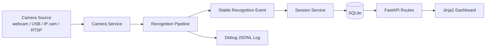
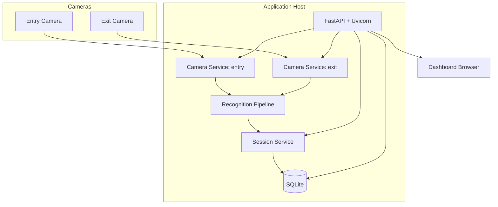
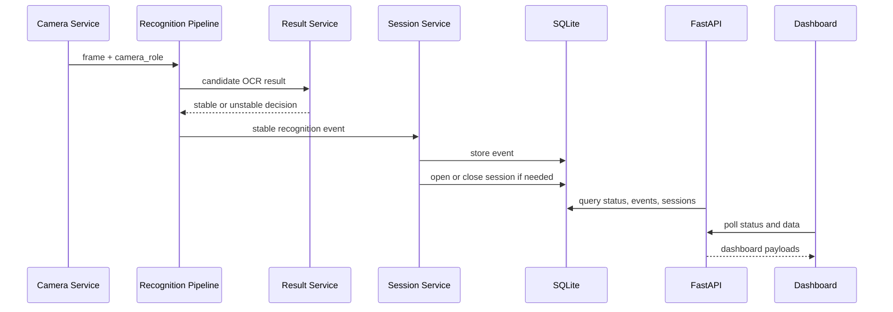
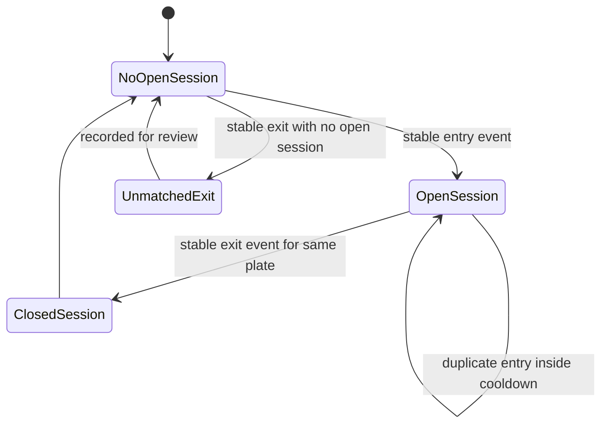

# Architecture

## Purpose

This document is the final and complete system architecture for this repository.

It defines:

- the target runtime design
- the boundaries between modules
- the data contracts between layers
- the database shape
- the API surface
- the configuration model
- the deployment model

This project starts as a plate-recognition prototype and is meant to evolve into a campus vehicle monitoring system with two camera roles:

- `entry`
- `exit`

The architecture in this document is the source of truth for that final system.

## Architecture Summary

The final system uses this stack:

- camera input: OpenCV-compatible local webcam, USB camera, phone IP camera, or RTSP stream
- backend: FastAPI
- detection: YOLO
- OCR: PaddleOCR as primary engine, with graceful fallback behavior if dependencies are missing
- post-processing: cleanup, validation, stabilization, deduplication, and entry or exit matching
- persistence: SQLite
- config: YAML
- frontend: Jinja2 plus vanilla JavaScript and CSS
- runtime: Uvicorn

The final architecture is split into five layers:

1. Camera ingestion
2. Recognition
3. Session management
4. Persistence
5. API and UI

Each layer has one job. Recognition reads plate text. Session management decides what the read means operationally. Persistence stores the result. The API and UI expose it.

## Design Principles

These rules govern the whole system:

- keep recognition logic separate from session lifecycle logic
- keep config in YAML, not hardcoded in runtime code
- use stable recognition events, not raw frame-by-frame OCR output, as the boundary into session logic
- keep one open session per plate unless the rules explicitly change later
- allow the app to start honestly even when detector weights or OCR dependencies are missing
- treat JSONL logs as debug output and SQLite as the durable source of truth
- preserve the current scope of one detector class: `plate_number`
- keep the current runtime behavior of selecting the highest-confidence final plate per frame

## System Context



The system accepts frames from real camera sources, turns those frames into stable recognition events, applies session rules, stores events and sessions in SQLite, and exposes the resulting state through FastAPI and a simple dashboard.

## Current Module Layout

The implementation now follows these practical boundaries inside `src/`:

- `src/app.py` is the FastAPI entry point only.
- `src/bootstrap.py` loads YAML config and builds core services.
- `src/runtime.py` assembles camera runtime objects and installs app state.
- `src/api/routes.py` is an orchestrator that registers smaller route modules.
- `src/api/*_routes.py` split the API by concern: pages, settings, prediction, cameras, dashboard, sessions, vehicles, performance, and moderation.
- `src/core/` holds pure-ish recognition concerns such as detector, OCR, post-processing, pipeline payloads, and artifact handling.
- `src/domain/models.py` defines shared typed event, session, and registry models.
- `src/services/` contains runtime coordination logic such as cameras, tracking, sessions, registry lookup, and logging.
- `src/storage/` contains SQLite connection management, schema creation, repositories, and bootstrap seeding.

This keeps the runtime dependency direction clear:

1. `app.py` and `runtime.py` compose objects.
2. API modules call services.
3. Services use domain models and repositories.
4. Repositories talk to SQLite.

## Deployment Topology

The expected deployment is a single local machine or campus workstation running the web app and connecting to one or two cameras.

### Target deployment shape

- one Python application process
- one FastAPI app served by Uvicorn
- one SQLite database file on local disk
- one `entry` camera source
- one `exit` camera source
- one browser dashboard for operators



## Runtime Layers

### 1. Camera Ingestion Layer

Primary responsibility:

- obtain frames from configured sources and tag them with a camera role

Accepted source types:

- integer OpenCV index such as `0`
- USB camera exposed through OpenCV
- phone IP camera URL
- RTSP stream URL

Current repo modules:

- `src/services/camera_service.py`: one worker for one source
- `src/services/camera_manager.py`: owns multiple camera workers keyed by role
- `src/services/tracking_service.py`: per-role tracking and OCR cadence control

This layer should:

- start and stop capture cleanly
- read frames on a background loop
- process every Nth frame based on settings
- maintain the latest payload for its source
- expose MJPEG-compatible stream output for the frontend

This layer should not:

- call SQLite directly for business decisions
- open or close sessions
- decide whether an event is duplicate or unmatched

### 2. Recognition Layer

Primary responsibility:

- convert a frame into the best available plate read

Current repo modules:

- `src/core/detector.py`
- `src/core/cropper.py`
- `src/core/ocr_engine.py`
- `src/core/postprocess.py`
- `src/core/pipeline.py`
- `src/services/result_service.py`

Recognition flow:

1. run YOLO detection
2. sort detections by confidence
3. keep the highest-confidence detection for the current system scope
4. crop and resize the plate image
5. run OCR
6. clean and normalize OCR output
7. stabilize repeated reads across recent frames
8. produce a stable recognition event when the threshold is met

This layer should not:

- understand entry and exit business rules
- manage database session state
- decide whether a plate should open or close a vehicle visit

### 3. Session Management Layer

Primary responsibility:

- turn stable recognition events into operational vehicle-session changes

Current module:

- `src/services/session_service.py`

This service is the boundary between recognition events and operational session state.

It should:

- receive stable recognition events
- enforce cooldown and debounce rules
- open a session on a valid `entry` event
- close the most recent matching open session on a valid `exit` event
- record unmatched exits
- provide active-session and history queries to the API layer

It should not:

- run YOLO or OCR
- own frame loops
- contain UI code

### 4. Persistence Layer

Primary responsibility:

- durably store recognition events and session state

Storage choice:

- SQLite

Current module:

- `src/services/storage_service.py`

Optional future split:

- `src/services/database_service.py` if storage concerns grow beyond current scope.

This layer should:

- initialize the schema if needed
- write stable recognition events
- create, update, and query sessions
- record unmatched exit events
- expose recent events and history data efficiently

### 5. API And UI Layer

Primary responsibility:

- expose system state and operator actions over HTTP

Current repo modules:

- `src/api/routes.py`
- `src/api/schemas.py`
- `templates/index.html`
- `static/js/app.js`
- `static/css/style.css`

This layer should:

- render the main dashboard
- expose image-upload inference
- expose camera control endpoints
- expose system status
- expose active sessions, session history, and recent events

This layer should not:

- contain detector logic
- contain SQL statements
- contain session business rules

## Final Module Ownership

The final repo should be organized around these responsibilities.

### `src/app.py` and `src/bootstrap.py`

Composition root plus wiring helpers.

Responsibilities:

- load YAML settings and auth config
- build detector, OCR, pipeline, storage, registry, and session services
- initialize output paths, runtime directories, and database path
- create role-aware camera and tracking services
- register middleware and API routes
- store shared objects on `app.state` and close resources on shutdown

### `src/core/`

Recognition-only code.

- `detector.py`: YOLO model loading and inference
- `cropper.py`: plate crop extraction and annotation
- `ocr_engine.py`: PaddleOCR-first OCR wrapper
- `postprocess.py`: cleanup and validation
- `pipeline.py`: recognition orchestration

### `src/services/`

Runtime and business services.

- `camera_service.py`: capture worker for one source
- `camera_manager.py`: role-aware manager for multiple sources
- `tracking_service.py`: tracker-backed OCR cadence and per-track stabilization decisions
- `result_service.py`: stabilization only
- `logging_service.py`: JSONL debug logging
- `performance_service.py`: runtime snapshot and summary metrics
- `vehicle_registry_service.py`: optional vehicle metadata lookups
- `session_service.py`: session rules and orchestration
- `storage_service.py`: SQLite data access and moderation operations

### `src/api/`

HTTP boundary.

- `auth.py`: admin auth middleware and cookie helpers
- `routes.py`: endpoints and template rendering
- `settings_support.py`: runtime settings and detector backend apply helpers
- `dashboard_support.py`: status snapshots, payload cache, and camera helper functions
- `upload_support.py`: upload validation and video-processing helpers
- `schemas.py`: request and response models

### `templates/` and `static/`

Thin operator dashboard.

This project does not need React for the current scope. Jinja2 plus vanilla JavaScript is the right tradeoff.

## Application Composition Root

The current `src/app.py` already acts as the composition root. It currently builds these objects in roughly this order:

1. settings and auth config
2. output paths and runtime directories
3. detector
4. OCR engine
5. post-processor
6. result stabilizer
7. logging and performance services
8. storage, vehicle-registry, and session services
9. tracking plus one camera service per configured role
10. camera manager and default role camera
11. API router

### Current `app.state`

The current app stores:

- `settings`
- `base_dir`
- `config_path`
- `server_time_factory`
- `auth_enabled`
- `auth_cookie_name`
- `auth_session_max_age`
- `auth_issue_cookie_value`
- `auth_is_valid_cookie`
- `detector`
- `detector_factory`
- `ocr_engine`
- `result_service`
- `logging_service`
- `performance_service`
- `pipeline`
- `storage_service`
- `vehicle_registry_service`
- `session_service`
- `video_upload_dir`
- `camera_manager`
- `camera_services`
- `camera_service` for the default role
- `default_camera_role`
- `latest_payloads` keyed by role
- `latest_payload`

The post-processor is still created in the app factory, but routes currently do not need direct access to it through `app.state`.

## Main Runtime Flow

The final runtime flow should be fixed and consistent.



The key rule is simple:

- the recognition pipeline produces events
- the session service decides what those events mean

## Recognition Event Contract

The boundary between recognition and session logic must be a stable recognition event.

Suggested payload:

```json
{
  "timestamp": "2026-04-18T11:00:00+08:00",
  "camera_role": "entry",
  "source_name": "entry_cam_1",
  "source_type": "camera",
  "raw_text": "ABC 1234",
  "cleaned_text": "ABC1234",
  "stable_text": "ABC1234",
  "plate_number": "ABC1234",
  "detector_confidence": 0.92,
  "ocr_confidence": 0.87,
  "ocr_engine": "paddleocr",
  "crop_path": "outputs/plate_crops/entry_20260418_110000.jpg",
  "annotated_frame_path": "outputs/annotated_frames/entry_20260418_110000.jpg",
  "is_stable": true
}
```

Required fields:

- `timestamp`
- `camera_role`
- `plate_number`
- `is_stable`

Important notes:

- `plate_number` should be the accepted stable text
- unstable OCR reads should not reach the session layer as actionable events
- `camera_role` is required for session logic

## Session State Machine

The final session lifecycle should follow this model:



### Session rules

- one open session per plate at a time
- a valid `entry` event opens a session only when none is already open
- a repeated `entry` read inside cooldown is ignored
- a valid `exit` event closes the most recent open session for the same plate
- a repeated `exit` read inside cooldown is ignored
- an `exit` event without a matching open session is written as an unmatched exit event

## Persistence Model

SQLite is the durable source of truth for runtime state.

The JSONL log at `outputs/demo_logs/events.jsonl` remains useful for debugging and audits, but it is not the authoritative operational database.

### Database path

Recommended path:

- `outputs/app_data/plate_events.db`

### Core tables

#### `recognition_events`

Purpose:

- store every stable recognition event that reaches the session layer

Suggested columns:

- `id`
- `timestamp`
- `camera_role`
- `source_name`
- `source_type`
- `raw_text`
- `cleaned_text`
- `stable_text`
- `plate_number`
- `detector_confidence`
- `ocr_confidence`
- `ocr_engine`
- `crop_path`
- `annotated_frame_path`
- `event_action`
- `created_session_id`
- `closed_session_id`

Suggested `event_action` values:

- `ignored_duplicate`
- `session_opened`
- `session_closed`
- `unmatched_exit`
- `logged_only`

#### `vehicle_sessions`

Purpose:

- store open and completed vehicle visits

Suggested columns:

- `id`
- `plate_number`
- `status`
- `entry_time`
- `exit_time`
- `entry_camera`
- `exit_camera`
- `entry_event_id`
- `exit_event_id`
- `entry_confidence`
- `exit_confidence`
- `entry_crop_path`
- `exit_crop_path`
- `notes`

Suggested `status` values:

- `open`
- `closed`

#### `unmatched_exit_events`

Purpose:

- store exit events that could not close a session

Suggested columns:

- `id`
- `recognition_event_id`
- `plate_number`
- `timestamp`
- `camera_role`
- `reason`
- `resolved`
- `notes`

### Recommended indexes

- index on `vehicle_sessions(plate_number, status)`
- index on `vehicle_sessions(entry_time)`
- index on `recognition_events(timestamp)`
- index on `recognition_events(camera_role, plate_number)`
- index on `unmatched_exit_events(timestamp, resolved)`

## API Surface

The final architecture keeps the current endpoints and adds the operational ones needed for sessions.

| Endpoint | Method | Purpose | Status |
| --- | --- | --- | --- |
| `/` | `GET` | Render dashboard | current |
| `/predict/image` | `POST` | Run still-image inference | current |
| `/camera/start` | `POST` | Start default camera mode | current |
| `/camera/stop` | `POST` | Stop default camera mode | current |
| `/stream` | `GET` | Stream MJPEG feed | current |
| `/latest-result` | `GET` | Return most recent recognition payload | current |
| `/status` | `GET` | Return detector, OCR, and camera readiness | current |
| `/cameras/{role}/start` | `POST` | Start a specific `entry` or `exit` camera | current |
| `/cameras/{role}/stop` | `POST` | Stop a specific `entry` or `exit` camera | current |
| `/cameras/{role}/stream` | `GET` | Stream a specific role camera | current |
| `/cameras/{role}/latest-result` | `GET` | Latest payload for one camera role | current |
| `/sessions/active` | `GET` | List active open sessions | current |
| `/sessions/history` | `GET` | List recent closed sessions | current |
| `/sessions/{session_id}` | `GET` | Retrieve one session | current |
| `/events/recent` | `GET` | List recent recognition events | current |
| `/events/unmatched-exit` | `GET` | List unmatched exit events | current |

### Response modeling

The repo already has `src/api/schemas.py`, and most API data routes now declare response models.

The final system should:

- keep Pydantic schemas as the API contract
- continue aligning remaining utility routes with those schemas where practical
- keep template and streaming routes explicit about their non-JSON response shape

## Configuration Model

YAML is the only source of truth for runtime configuration.

The current `configs/app_settings.yaml` already covers:

- `app`
- `auth`
- `paths`
- `detector`
- `ocr`
- `postprocess`
- `stabilization`
- `tracking`
- `stream`
- `performance`
- `vehicle_registry`
- `artifacts`
- `uploads`
- `video_upload`
- `session`
- `camera`
- `cameras`

The final architecture should evolve that into:

```yaml
app:
  title: USM License Plate Recognition System
  subtitle: Two-Stage YOLO + OCR Prototype
  university: University of Southern Mindanao
  debug: true

paths:
  detector_weights: models/detector/yolo26nbest.pt
  database_path: outputs/app_data/plate_events.db
  event_log_path: outputs/demo_logs/events.jsonl
  annotated_output_dir: outputs/annotated_frames
  crop_output_dir: outputs/plate_crops

detector:
  confidence_threshold: 0.3
  iou_threshold: 0.5
  padding_ratio: 0.05
  max_detections: 5

ocr:
  preferred_engine: paddleocr
  fallback_engine: easyocr
  min_confidence: 0.3
  resize_width: 320

postprocess:
  uppercase: true
  strip_non_alnum: true
  collapse_spaces: true
  apply_soft_rules: false

stabilization:
  history_size: 5
  min_repetitions: 2
  process_every_n_frames: 3

session:
  enabled: true
  cooldown_seconds: 15
  allow_only_one_open_session_per_plate: true
  store_unmatched_exit_events: true

cameras:
  entry:
    source: 0
    width: 1280
    height: 720
    fps_sleep_seconds: 0.03
  exit:
    source: rtsp://example/stream
    width: 1280
    height: 720
    fps_sleep_seconds: 0.03
```

### Configuration rules

- never hardcode detector weights, database paths, or camera sources in runtime code
- keep session cooldown and business toggles in YAML
- keep camera roles declarative in YAML

## Frontend Architecture

The frontend remains intentionally simple and server-rendered.

### Why Jinja2 plus vanilla JavaScript is the correct choice

- the app is dashboard-like, not a complex SPA
- the project already uses FastAPI templates cleanly
- operational data is simple enough for polling and MJPEG streaming
- the thesis and prototype scope does not require React

### Final dashboard responsibilities

- show system status
- show image-upload inference results
- show live camera feeds
- show current active sessions
- show recent entries and exits
- show recent unmatched exits

### Recommended UI sections

- app header and runtime readiness
- image-upload recognition panel
- entry camera panel
- exit camera panel
- active vehicles table
- recent event history table
- unmatched exit review table

## Runtime Modes And Graceful Degradation

The app should remain honest about what is available.

### Detector readiness

- if `models/detector/yolo26nbest.pt` is missing while the backend is `ultralytics`, detector mode should report `missing_weights`
- the app should still start and serve the dashboard

### OCR readiness

- if PaddleOCR is unavailable, fall back if possible
- if no OCR engine is available, report it honestly and avoid fake success states

### Session readiness

- if SQLite initialization fails, session endpoints should report that failure explicitly
- recognition-only features can still remain available if the app chooses to degrade gracefully

## Current State Versus Final State

The current repo already has:

- FastAPI app composition in `src/app.py`
- YOLO detector integration
- OCR wrapper with graceful behavior
- cleanup and stabilization logic
- role-aware camera services plus camera manager
- image upload inference
- live camera inference
- Jinja2 dashboard
- JSONL event logging
- session orchestration and SQLite persistence
- session/event API endpoints and moderation routes

The final system still needs these implementation pieces:

- broader integration and end-to-end automated coverage
- stronger schema-first API response typing on remaining ad hoc routes
- migration/versioning strategy for database evolution

## Security And Data Handling

Plate images and vehicle-session records should be treated as sensitive project data.

Architecture-level rules:

- keep original data in `data/raw/`
- keep generated artifacts in `outputs/`
- avoid destructive edits to raw data
- do not expose private data publicly
- keep persistence local unless an explicit future deployment model is chosen

## Local-First Principle And Online Layer

### Core architectural constraint

**Local first, online second.**

The local LPR system is the source of truth during runtime. It must remain fully functional when there is no internet connection. An online dashboard, if added, is a synchronized mirror and reporting layer — not part of the critical recognition loop.

### Two separate layers

#### Layer A — Local LPR runtime

This is the real system. It handles:

- camera stream intake
- YOLO plate detection
- crop extraction
- OCR
- text cleanup and validation
- entry and exit matching
- local SQLite event and session storage

This layer must work completely offline.

#### Layer B — Online dashboard and sync layer (optional)

This layer is only for:

- centralized viewing from another device
- cross-device dashboard access
- long-term storage or backup
- admin reporting
- remote monitoring

This layer consumes results from the local system. It does not replace it.

### Data flow

The healthy architecture looks like this:

```
Phone / IP cam
  → local laptop LPR system
    → local SQLite event and session store
      → background sync service uploads selected records
        → online dashboard database
          → web dashboard
```

The online dashboard is downstream. It is never in the critical recognition path.

### What this enables

When done properly, the system gains:

- local real-time operation with no internet dependency
- online visibility from any device
- centralized records for reporting
- better presentation value for thesis defense
- easier monitoring from another location

### What breaks this

The architecture fails if the online layer becomes a runtime dependency.

Bad pattern:

```
camera stream comes in
  → local system tries to detect
    → every event must hit the internet immediately
      → if network fails, recognition or logging breaks
```

That is weak engineering.

The online layer must be:

- optional — the system runs without it
- asynchronous — sync happens in the background
- non-blocking — recognition never waits on a network call
- failure-tolerant — if sync fails, local detection and logging continue normally

### Sync policy

Not every piece of data should be synced. Stream only useful records.

Records that should sync:

- detected plate text (`plate_number`)
- event type (`entry` or `exit`)
- timestamp
- confidence values
- session state (`open` or `closed`)
- camera role and source identifier
- optionally: plate crop image on confirmed events
- optionally: annotated frame snapshot on confirmed events

Records that should not sync:

- every raw frame
- intermediate unstable reads
- debug-level pipeline payloads
- full MJPEG video streams

### Recommended sync mechanism

```
1. store all important events locally first (SQLite)
2. mark new records as unsynced
3. a background sync worker sends unsynced records when internet is available
4. once the remote server acknowledges receipt, mark the record as synced
5. if sync fails, retry on next cycle — local operation is unaffected
```

### Suggested sync-related modules

If the online layer is implemented, the repo would need:

| Module | Responsibility |
| --- | --- |
| `src/services/sync_service.py` | Background worker that reads unsynced records from SQLite and uploads them |
| `src/services/sync_client.py` | HTTP client for the remote API, with retry logic |
| sync status column in SQLite | `synced` boolean or `sync_status` enum on `recognition_events` and `vehicle_sessions` |
| remote API | Cloud-side REST endpoint that receives event and session records |
| online dashboard | Separate web application or hosted dashboard that reads from the online database |

### Suggested sync configuration

```yaml
sync:
  enabled: false
  remote_api_url: https://example.com/api/events
  retry_interval_seconds: 30
  max_retry_attempts: 5
  sync_crops: false
  sync_snapshots: false
```

`enabled: false` by default. The local system never depends on this section existing.

### Online-side components

If the online layer is built, it would consist of:

- a cloud or hosted backend API (could be another FastAPI instance)
- an online database (PostgreSQL, Supabase, or similar)
- a web dashboard (could be a separate Jinja2 app, or a lightweight SPA)
- authentication for admin access

These components live outside this repository. They are a separate deployment.

### Phase plan

The correct build order is:

**Phase 1 — Local-first LPR system (current priority)**

Complete the local system:

- camera ingestion by role
- detection, OCR, cleanup, stabilization
- session service with entry and exit matching
- SQLite persistence
- local dashboard
- graceful degradation

This phase must be fully working before any online work begins.

**Phase 2 — Optional sync layer**

Add background sync:

- `sync_service.py` that reads unsynced records
- REST client that uploads to a remote endpoint
- sync status tracking in SQLite
- retry and failure handling
- sync configuration in YAML

**Phase 3 — Online dashboard**

Build or deploy a remote dashboard:

- cloud backend API
- online database
- reporting views
- remote monitoring

Each phase is independently deployable. Phase 1 is the capstone deliverable. Phases 2 and 3 are enhancements.

## Out Of Scope

The final architecture does not include these as required runtime features:

- custom OCR model training as a mandatory runtime dependency
- multiple final session decisions from many plates in one frame
- a heavy frontend SPA framework
- in-memory-only session tracking
- business rules embedded directly into detector or OCR modules
- internet connectivity as a prerequisite for local recognition or logging
- real-time frame streaming to a remote server

## Definition Of Complete Architecture

### Phase 1 complete (local system)

This architecture should be considered complete for Phase 1 when all of these are true:

- camera sources can be configured by role in YAML
- one or two camera services can run with explicit `entry` and `exit` roles
- the recognition pipeline emits stable recognition events
- a dedicated session service handles deduplication and matching
- SQLite stores recognition events and vehicle sessions
- FastAPI exposes active sessions, history, and recent events
- the dashboard shows live operational state
- the app degrades honestly when detector, OCR, or session storage is unavailable
- the entire system works with no internet connection

### Phase 2 complete (sync layer)

Phase 2 is complete when:

- a background sync worker uploads unsynced records to a remote API
- sync failures do not affect local operation
- sync status is tracked per record in SQLite
- sync is configurable and disabled by default

### Phase 3 complete (online dashboard)

Phase 3 is complete when:

- a remote dashboard displays synced recognition events and sessions
- the dashboard is accessible from another device
- the online layer is fully decoupled from local runtime

## Immediate Build Sequence

### Phase 1 — Local system

1. add `session` and `cameras` sections to `configs/app_settings.yaml`
2. split single-camera assumptions into role-aware camera handling
3. define and emit a stable recognition event object
4. add SQLite initialization and schema creation
5. implement `src/services/session_service.py`
6. add session and event API routes plus schemas
7. update the dashboard for entry, exit, active sessions, and history

### Phase 2 — Sync layer

8. add `sync` section to `configs/app_settings.yaml` with `enabled: false`
9. add `sync_status` column to SQLite tables
10. implement `src/services/sync_service.py` with background upload loop
11. implement `src/services/sync_client.py` with retry logic
12. verify local system is unaffected when sync is disabled or fails

### Phase 3 — Online dashboard

13. deploy a remote API that accepts event and session records
14. deploy an online database
15. build or deploy a reporting dashboard
16. connect the sync service to the remote endpoint

Phase 1 is the capstone deliverable. Phases 2 and 3 are optional enhancements that strengthen the project without creating runtime dependencies.
